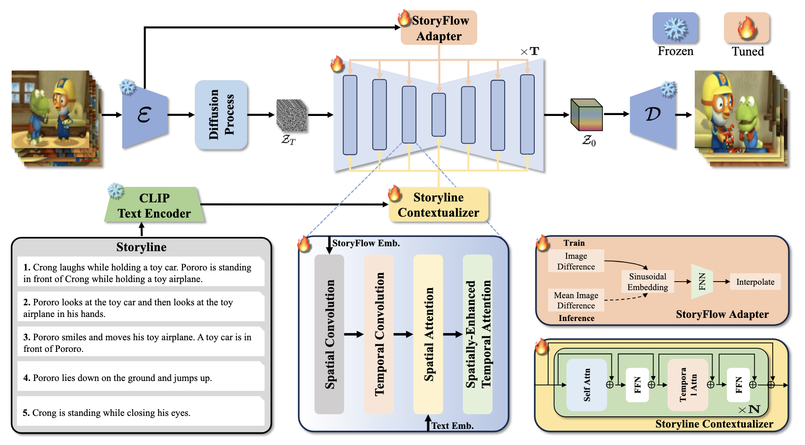

# ContextualStory: Consistent Visual Storytelling with Spatially-Enhanced and Storyline Context (AAAI 2025)

<div align="center">
  
[](https://arxiv.org/pdf/2407.09774)&nbsp;
<a href="https://huggingface.co/collections/sxzheng/contextualstory-68d804b32b78632a2090a08c"></a>
</div>

## 📖 Abstract

> **Paper:** [ContextualStory: Consistent Visual Storytelling with Spatially-Enhanced and Storyline Context](https://arxiv.org/abs/2407.09774)  
> **Authors:** [Sixiao Zheng](https://scholar.google.com/citations?user=PIvAYo0AAAAJ&hl=en), [Yanwei Fu](https://yanweifu.github.io/)  
> **Institution:** Fudan University, Shanghai Innovation Institute  
> **Conference:** AAAI 2025


Visual storytelling involves generating a sequence of coherent frames from a textual storyline while maintaining consistency in characters and scenes. Existing autoregressive methods, which rely on previous frame-sentence pairs, struggle with high memory usage, slow generation speeds, and limited context integration. To address these issues, we propose ContextualStory, a novel framework designed to generate coherent story frames and extend frames for story continuation. ContextualStory utilizes Spatially-Enhanced Temporal Attention to capture spatial and temporal dependencies, handling significant character movements effectively. Additionally, we introduces a Storyline Contextualizer to enrich context in storyline embedding and a StoryFlow Adapter to measure scene changes between frames for guiding model. Extensive experiments on PororoSV and FlintstonesSV benchmarks demonstrate that ContextualStory significantly outperforms existing methods in both story visualization and story continuation.

## 🏗️ Architecture

<div align="center">
  
</div>

**Architecture Overview:** Each UNet block includes temporal convolution and Spatially-Enhanced Temporal Attention to effectively capture complex spatial and temporal dependencies. The Storyline Contextualizer enriches the storyline embedding by integrating context information from all text embeddings, while the StoryFlow Adapter measures scene changes by computing differences between adjacent frames.

## 🚀 Quick Start

### 1. Environment Setup

Clone the repository and set up the conda environment:

```bash
git clone https://github.com/sixiaozheng/ContextualStory.git
cd ContextualStory

# Create and activate conda environment
conda env create -f environment.yaml
conda activate contextualstory
```

### 2. Download Datasets

| Dataset | Download Link | Notes |
|---------|---------------|-------|
| **PororoSV** | 🤗 [Hugging Face](https://huggingface.co/datasets/sxzheng/PororoSV/tree/main) | `unzip pororo_png_filtered_blip2.zip` |
| **FlintstonesSV** | 🤗 [Hugging Face](https://huggingface.co/datasets/sxzheng/FlintstonesSV/tree/main) | `unzip video_frames_sampled.zip` |

### 3. Download Models

| Task | Dataset | Model |
|------|---------|-------|
| **Story Visualization** | PororoSV | 🤗 [ContextualStory-sv-pororo](https://huggingface.co/sxzheng/ContextualStory-sv-pororo) |
| **Story Visualization** | FlintstonesSV | 🤗 [ContextualStory-sv-flintstones](https://huggingface.co/sxzheng/ContextualStory-sv-flintstones) |
| **Story Continuation** | PororoSV | 🤗 [ContextualStory-sc-pororo](https://huggingface.co/sxzheng/ContextualStory-sc-pororo) |
| **Story Continuation** | FlintstonesSV | 🤗 [ContextualStory-sc-flintstones](https://huggingface.co/sxzheng/ContextualStory-sc-flintstones) |


## 🏋️ Training

### Story Visualization

#### PororoSV Dataset
```bash
CONFIG=configs/visualization/training_contextualstory_sv_pororo.yaml
NAME=trainval_40k

accelerate launch --mixed_precision="bf16" --multi_gpu --main_process_port=29502 train.py \
    --config=$CONFIG -n=$NAME --wandb
```

#### FlintstonesSV Dataset
```bash
CONFIG=configs/visualization/training_contextualstory_sv_flintstones.yaml
NAME=trainval_80k

accelerate launch --mixed_precision="bf16" --multi_gpu --main_process_port=29502 train.py \
    --config=$CONFIG -n=$NAME --wandb
```

### Story Continuation

#### PororoSV Dataset
```bash
CONFIG=configs/continuation/training_contextualstory_sc_pororo.yaml
NAME=trainval_40k

accelerate launch --mixed_precision="bf16" --multi_gpu --main_process_port=29502 train.py \
    --config=$CONFIG -n=$NAME --wandb
```

#### FlintstonesSV Dataset
```bash
CONFIG=configs/continuation/training_contextualstory_sc_flintstones.yaml
NAME=trainval_80k

accelerate launch --mixed_precision="bf16" --multi_gpu --main_process_port=29502 train.py \
    --config=$CONFIG -n=$NAME --wandb
```
## 📊 Evaluation

### Story Visualization

#### PororoSV Dataset
```bash
CONFIG=configs/visualization/training_contextualstory_sv_pororo.yaml
NAME=trainval_40k
NUM_GPU=1

accelerate launch --num_processes=$NUM_GPU --main_process_port=29502 eval.py \
    --config=$CONFIG -n=$NAME
```

#### FlintstonesSV Dataset
```bash
CONFIG=configs/visualization/training_contextualstory_sv_flintstones.yaml
NAME=trainval_80k
NUM_GPU=1

accelerate launch --num_processes=$NUM_GPU --main_process_port=29502 eval.py \
    --config=$CONFIG -n=$NAME
```

### Story Continuation

#### PororoSV Dataset
```bash
CONFIG=configs/continuation/training_contextualstory_sc_pororo.yaml
NAME=trainval_40k
NUM_GPU=1

accelerate launch --num_processes=$NUM_GPU --main_process_port=29502 eval.py \
    --config=$CONFIG -n=$NAME
```

#### FlintstonesSV Dataset
```bash
CONFIG=configs/continuation/training_contextualstory_sc_flintstones.yaml
NAME=trainval_80k
NUM_GPU=1

accelerate launch --num_processes=$NUM_GPU --main_process_port=29502 eval.py \
    --config=$CONFIG -n=$NAME
```


## 📚 Citation

If you find this work useful, please cite our paper:

```bibtex
@article{ContextualStory_Zheng_Fu_2025,
    title={ContextualStory: Consistent Visual Storytelling with Spatially-Enhanced and Storyline Context},
    volume={39},
    url={https://ojs.aaai.org/index.php/AAAI/article/view/33153},
    DOI={10.1609/aaai.v39i10.33153},
    number={10},
    journal={Proceedings of the AAAI Conference on Artificial Intelligence},
    author={Zheng, Sixiao and Fu, Yanwei},
    year={2025},
    month={Apr.},
    pages={10617-10625}
}
```

## 🙏 Acknowledgements

We sincerely appreciate the code release of the following projects:
- [SeerVideoLDM](https://github.com/seervideodiffusion/SeerVideoLDM)
- [ConsistI2V](https://github.com/TIGER-AI-Lab/ConsistI2V)
- [Diffusers](https://github.com/huggingface/diffusers)

## 📄 License

This project is licensed under the MIT License - see the [LICENSE](LICENSE) file for details.

